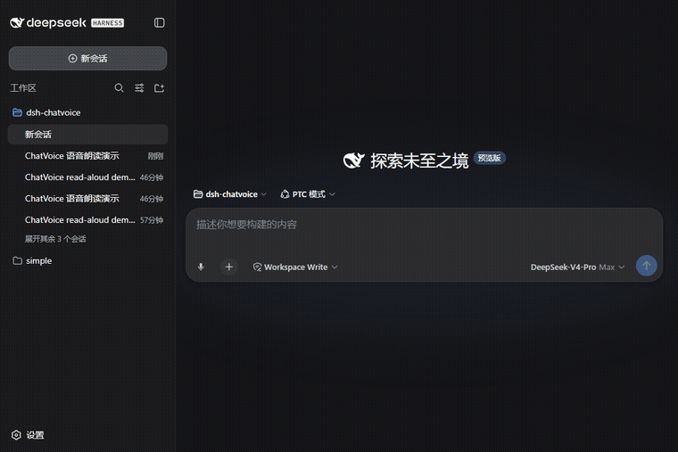

# ChatVoice 🎤🔊 — dsh-chatvoice

**English** | [中文](README.md)
> **Free, zero-config, no-API-key voice for DeepSeek Harness (dsh): speak your prompts and have AI replies read aloud.**
> Everything runs on the browser's native Web Speech API — no backend, no key, nothing to register.

<p align="center">
  
</p>

<p align="center">
  
  
  
  
  
</p>

**ChatVoice = Chat + Voice**: one plugin for both your mouth and your ears — dictate prompts while your hands stay on the keyboard, and let AI read long replies to you (listening-based learning, accessibility, or just lying back).

## Features

| # | Feature | Details |
|---|---|---|
| 1 | 🎤 Voice input | Mic button in the composer toolbar: click once and **keep talking** — live interim results appear as you speak, sentence after sentence accumulates; click again to stop and the text stays in the input box. **Type corrections anytime while listening** — recognition keeps running and newly recognized text is appended on stop without touching your edits |
| 2 | 🔊 Read aloud | Speaker button on every assistant reply; click again to stop anytime |
| 3 | 🔁 Auto-read | When enabled, new replies are read aloud automatically (interruptible at any time) |
| 4 | ⚙️ Settings | dsh Settings → ChatVoice: recognition language / auto-read / voice / rate — **saved instantly, no restart** |
| 5 | 🛡 Friendly errors | Mic permission denied / browser unsupported / insecure context / network failure — every case shows a readable toast, never a silent failure |
| 6 | 🇨🇳 Chinese-first | zh-CN recognition + auto-picks Edge's free natural Chinese voice `Xiaoxiao Online (Natural)` |

## Why Edge is recommended

| Capability | Chrome | Edge | Notes |
|---|---|---|---|
| Speech recognition | ✅ (via Google servers) | ✅ (**via Azure — more reliable in China**) | Chrome may fail with a network error on some networks |
| Speech voices | Some online voices | ✅ **Xiaoxiao Online (Natural)** — the most natural free Chinese voice | Online voices need network access |
| Microphone (secure context) | localhost/HTTPS only | Same | dsh web defaults to `http://127.0.0.1:3080` ✅; mic is unavailable over LAN IP (read-aloud still works) |

## Install

```bash
dsh plugin --profile web add dsh-chatvoice
# or manually: pnpm add dsh-chatvoice (dsh.profile.bundles reconciles automatically)
```

Restart dsh web (`dsh web`) and open `http://127.0.0.1:3080`.

> ⚠️ You must access dsh web via `127.0.0.1`: speech recognition requires a secure context (HTTPS or localhost). Over a LAN IP the browser blocks the microphone — input is disabled with a hint, read-aloud still works.

## Usage

1. **Voice input**: click 🎤 in the composer toolbar → allow the microphone permission → keep talking (interim results show live, sentences accumulate) → click 🎤 again to stop → the text is in the input box, press Enter to send. While listening you can **type directly to fix misrecognized words** — the bubble shows "Typing, still listening…" and later recognized text is appended when you stop, without overwriting your edits
2. **Read aloud**: click 🔊 next to an assistant reply → it reads aloud (button turns into a red ⏹) → click again to stop
3. **Auto-read**: Settings → ChatVoice → enable "Auto-read new replies" → save; new replies are read automatically

## Settings

| Setting | Default | Description |
|---|---|---|
| Recognition language | `zh-CN` | `zh-CN` / `en-US` |
| Auto-read | off | Read new replies automatically when they complete (kept off by default — don't be too noisy) |
| Voice | empty = auto | Auto-picks the best Chinese voice (Xiaoxiao Online (Natural)); or enter any voice name your browser provides |
| Rate | `1.0` | `0.5` (slow) ~ `2` (fast) |

## How it works

- **host** (`dsh/index.js`): Config schema + `GET/POST /dsh-chatvoice/config` route; settings persist to `~/.dsh/chatvoice.json`
- **client** (`client/client.js`): MutationObserver injects the mic button (composer toolbar) and speaker buttons (assistant reply rows); `SpeechRecognition` for input; `speechSynthesis` for read-aloud
- Everything comes from the browser: the plugin makes **no network requests, spawns no subprocesses, and needs no API key**

## Known limitations

- Chrome's speech recognition goes through Google servers — on some networks it reports a `network` error → switch to Edge (Azure)
- Edge's online voices need network access; offline it falls back to the system's local voices
- Firefox / Safari don't support SpeechRecognition (the mic button is disabled with a hint; read-aloud still works)
- Recognition accuracy depends on the browser and your microphone, not the plugin

## Roadmap (Phase 2)

- 🎙 Push-to-talk (hold Space to dictate, release to send — WeChat-style)
- 🔊 edge-tts voices (XiaoxiaoNeural, generated server-side + attachment-route playback)
- 🗣 Voice commands ("save", "continue", "stop" and other spoken triggers)
- 📼 Voice memos: recordings transcribed into session drafts
- 🧩 An agent-callable read-aloud tool (host registers `read_aloud`, so the model can speak during replies)

## License

MIT © [FuzzySoul](https://github.com/FuzzySoul)
