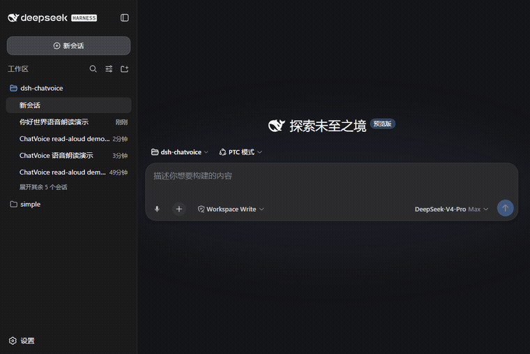
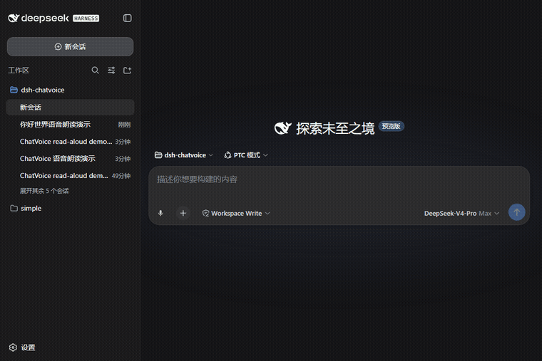
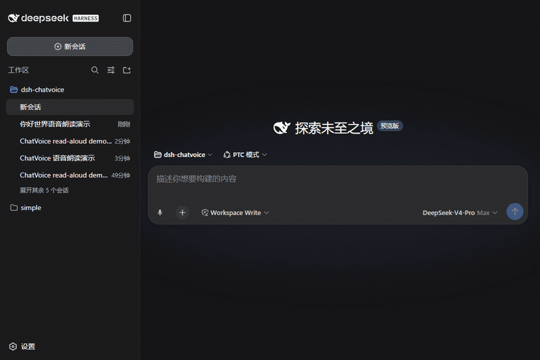

# Talk to Text 🎤🔊 — dsh-talk-to-text

**English** | [中文](README.md)
> **Use natural voice to think with a context-aware model, continuously maintain an editable draft, and submit a mature instruction or finished text to the main Agent.**
> A registered Doubao Realtime Duplex 3.0 route is the default; OpenAI Realtime and free append-only browser Web Speech remain available.

<p align="center">
  <br/>
  <sub>🎤 Voice input: each confirmed sentence lands in the box in real time</sub>
</p>

<p align="center">
  <br/>
  <sub>🔊 Read aloud: click the speaker on any reply, stop anytime</sub>
</p>

<p align="center">
  <br/>
  <sub>✏️ Edit while listening: Doubao/OpenAI Realtime revise earlier text; browser fallback remains append-only</sub>
</p>

<p align="center">
  
  
  
  
  
  
</p>

**Talk to Text = Talk → Deliberate → Draft → Revise → Commit.** It is not merely speech-to-text: hold an interruptible full-duplex voice discussion with the Realtime model. Spoken replies never enter the draft; only a separate draft mutation can change the text, and submission to the main Agent remains explicit.

## Features

| # | Feature | Details |
|---|---|---|
| 1 | 💬 Full-duplex discussion | Doubao or GPT Realtime answers in audio and the user can interrupt at any time; pure discussion never touches the draft |
| 2 | ✏️ Working draft | Only an `update_working_draft` operation replaces the complete draft; dictation, revision, deletion, reordering, and concurrent keyboard edits are supported |
| 3 | ✅ Finalize and commit | “Finalize draft” uses an auto-discovered registered text model over the voice discussion and current draft; “Send to Agent” is the explicit submission boundary |
| 4 | 🔊 Read aloud | Speaker button on every assistant reply; click again to stop anytime |
| 5 | 🔁 Auto-read | When enabled, new replies are read aloud automatically (interruptible at any time) |
| 6 | ⚙️ Model registry | Compatible Realtime routes are discovered automatically; one is auto-selected and multiple routes remain selectable, with credentials kept on the host |

## Why Edge is recommended

| Capability | Chrome | Edge | Notes |
|---|---|---|---|
| Speech recognition | ✅ (via Google servers) | ✅ (**via Azure — more reliable in China**) | Chrome may fail with a network error on some networks |
| Speech voices | Some online voices | ✅ **Xiaoxiao Online (Natural)** — the most natural free Chinese voice | Online voices need network access |
| Microphone (secure context) | localhost/HTTPS only | Same | dsh web defaults to `http://127.0.0.1:3080` ✅; mic is unavailable over LAN IP (read-aloud still works) |

## Install

```bash
dsh plugin --profile web add dsh-talk-to-text
# or manually: pnpm add dsh-talk-to-text (dsh.profile.bundles reconciles automatically)
```

Restart dsh web (`dsh web`) and open `http://127.0.0.1:3080`.

> ⚠️ You must access dsh web via `127.0.0.1`: speech recognition requires a secure context (HTTPS or localhost). Over a LAN IP the browser blocks the microphone — input is disabled with a hint, read-aloud still works.

## Usage

1. Click 🎤 and say the unfinished idea, question, choice, or edit you are considering.
2. The model replies in audio and can be interrupted at any time. The workspace shows a transcript while the Agent composer holds the separate editable draft.
3. Keep speaking or edit the draft with the keyboard. Concurrent keyboard edits win and are never overwritten.
4. Click “Finalize draft” to distill the same Realtime discussion and current draft into a mature, self-contained result.
5. Review it and click “Send to Agent”. Nothing crosses into the normal DSH Agent message flow before that action.

Reply read-aloud and automatic read-aloud remain available on assistant messages and in Settings.

### Doubao Realtime Duplex (default)

The model registry includes `doubao/realtime-duplex-3.0` (model `1.2.6.1`). Enable it under **Settings → Models → Doubao Speech** and configure only:

- `DOUBAO_API_KEY`

Saving the provider automatically opens a short connection and reports success only after authentication and Realtime session initialization. Talk to Text no longer stores these provider credentials.

The host proxies the JSON WebSocket protocol at `wss://openspeech.bytedance.com/api/v3/duplex/realtime/dialogue` using the new console's single `X-Api-Key` authentication. Credentials, endpoint, instructions, and tool definitions stay server-owned. The browser streams 16 kHz PCM and plays queued 24 kHz PCM with immediate interruption. Native function calling supplies the same isolated `update_working_draft` side channel used by OpenAI.

### OpenAI Realtime input

Start the DSH host with a standard API key. The key stays in the host process; it is never saved to `~/.dsh/talk-to-text.json` or sent to the browser:

```bash
OPENAI_API_KEY=your_api_key dsh web
```

Talk to Text reads compatible GPT Realtime routes from `dsh-multi-model-provider` and `llm-pi-ai`. One route is selected automatically; registering more routes makes them appear in the model dropdown. The registered model, base URL, and credential reference remain authoritative.

Realtime receives the current draft, workspace name, and six recent visible user/assistant messages as bounded application context. Hidden system prompts, tool arguments, and reasoning are excluded; the host caps the initial application context at 4,000 characters.

Realtime audio output is the discussion channel; the `update_working_draft` function is the draft-mutation side channel. Pure discussion produces only a spoken reply. Dictation, an explicit edit, an accepted conclusion, or finalization produces the complete new draft, a short mutation summary, and a `drafting/ready` status. The client applies the operation, returns its function result to the same session, and Realtime acknowledges it by voice.

## Settings

| Setting | Default | Description |
|---|---|---|
| Recognition provider | Doubao Realtime Duplex | Registered Doubao/OpenAI Realtime route, or free browser Web Speech fallback |
| Recognition language | `zh-CN` | `zh-CN` / `en-US` |
| Realtime model | First compatible registered route | Auto-discovered; multiple routes appear in a dropdown |
| Deliberation context | Draft + recent visible conversation | Can be limited to draft-only or disabled |
| Auto-read | off | Read new replies automatically when they complete (kept off by default — don't be too noisy) |
| Voice | empty = auto | Auto-picks the best Chinese voice (Xiaoxiao Online (Natural)); or enter any voice name your browser provides |
| Rate | `1.0` | `0.5` (slow) ~ `2` (fast) |

## How it works

- **host** (`dsh/index.js`, `dsh/doubao.js`): resolves registered models and credentials, initializes OpenAI WebRTC or a same-origin Doubao WebSocket proxy, and never exposes long-lived keys
- **client** (`client/client.js`): uses WebRTC for OpenAI or Web Audio PCM streaming for Doubao, while both backends share the isolated draft-tool path
- Realtime server VAD creates responses and supports interruption; `update_working_draft` is called only when the draft actually needs to change
- The client applies the mutation, returns `function_call_output`, and asks the same session for a brief spoken acknowledgement; “Finalize draft” stays in that session
- “Send to Agent” reuses DSH's native send action, so the main model receives its normal full Agent history plus the finalized draft

## Known limitations

- Chrome's speech recognition goes through Google servers — on some networks it reports a `network` error → switch to Edge (Azure)
- Edge's online voices need network access; offline it falls back to the system's local voices
- Firefox / Safari don't support SpeechRecognition (the mic button is disabled with a hint; read-aloud still works)
- Recognition accuracy depends on the browser and your microphone, not the plugin
- OpenAI Realtime incurs API usage and requires the host to reach the OpenAI API
- Doubao Duplex 3.0 must be enabled in the new Speech console and needs `DOUBAO_API_KEY`; registry presence alone does not prove entitlement

## Roadmap (Phase 2)

- 🎙 Push-to-talk (hold Space to dictate, release to send — WeChat-style)
- 🔊 edge-tts voices (XiaoxiaoNeural, generated server-side + attachment-route playback)
- 🗣 Voice commands ("save", "continue", "stop" and other spoken triggers)
- 📼 Voice memos: recordings transcribed into session drafts
- 🧩 An agent-callable read-aloud tool (host registers `read_aloud`, so the model can speak during replies)

## License

MIT © [FuzzySoul](https://github.com/FuzzySoul)
