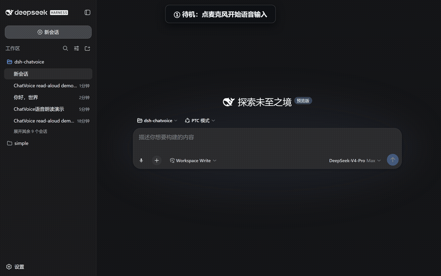
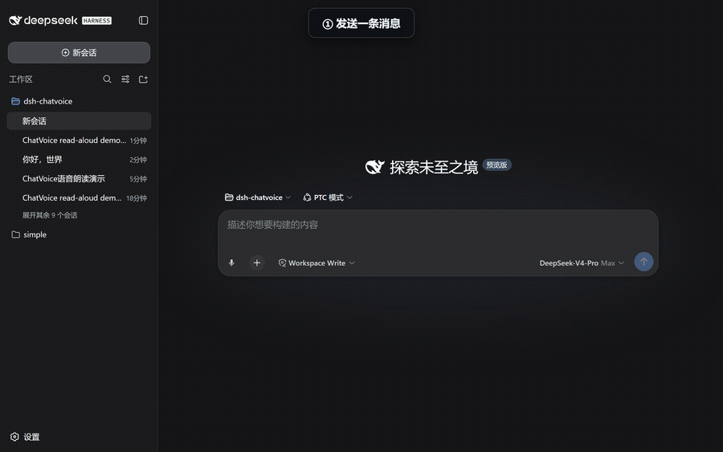
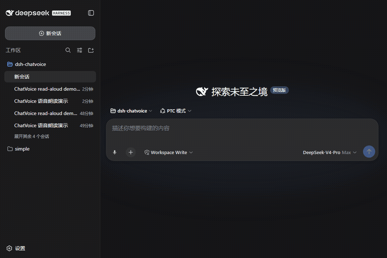

# ChatVoice 🎤🔊 — dsh-chatvoice

[English](README.en.md) | **中文**

> **让用户通过自然语音与一个上下文感知的模型共同思考，并持续维护一份可编辑草稿，最终将成熟的意图或成品文本提交给主 Agent。**
> 默认使用模型注册表中的豆包 Realtime Duplex 3.0；同时保留 OpenAI Realtime 与免费、只追加的浏览器 Web Speech 回退。

<p align="center">
  <br/>
  <sub>🎤 语音输入：确认句逐句实时入框，中间结果进气泡</sub>
</p>

<p align="center">
  <br/>
  <sub>🔊 回复朗读：点小喇叭一键朗读，可随时打断</sub>
</p>

<p align="center">
  <br/>
  <sub>✏️ 边听边改：豆包/OpenAI Realtime 可修改前文；浏览器回退仍是只追加</sub>
</p>

<p align="center">
  
  
  
  
  
  
</p>

**ChatVoice = Talk → Deliberate → Draft → Revise → Commit**。它不是单纯的语音转文字：用户可以与 Realtime 模型进行可随时插话的双工语音讨论；模型语音回复不进入草稿，只有独立的草稿修改操作才会改变文本，且只有用户明确提交时才发给主 Agent。

## 功能

| # | 功能 | 说明 |
|---|---|---|
| 1 | 💬 双工讨论 | 豆包或 GPT Realtime 用语音回应，用户可随时插话；纯讨论不会触碰草稿 |
| 2 | ✏️ 工作草稿 | 只有 `update_working_draft` 修改操作会更新完整草稿；支持口述、修改、删除、重排和键盘并行编辑 |
| 3 | ✅ 定稿与提交 | 点击“整理成最终稿”由注册表中的文本模型基于草稿与语音讨论收束文本；点击“提交给 Agent”才跨过提交边界 |
| 4 | 🔊 回复朗读 | 每条助手回复旁小喇叭，一键朗读该条；点击变「停止」随时打断 |
| 5 | 🔁 自动朗读 | 设置页开启后，新回复完成自动朗读（可随时打断） |
| 6 | ⚙️ 模型注册 | 自动发现兼容 Realtime 路由；只有一个时自动选择，多个时允许切换，密钥留在 host |

## 为什么推荐 Edge

| 能力 | Chrome | Edge | 说明 |
|---|---|---|---|
| 语音识别 | ✅（识别走 Google 服务器） | ✅（**识别走 Azure，国内更稳**） | 国内网络下 Chrome 可能报 network 错误 |
| 朗读音色 | 部分在线音色 | ✅ **Xiaoxiao Online (Natural)** 免费中文最自然 | 在线音色需联网 |
| 麦克风（安全上下文） | 仅 localhost/HTTPS | 同左 | dsh web 默认 http://127.0.0.1:3080 ✅；LAN IP 访问麦克风不可用（朗读不受影响） |

## 安装

```bash
dsh plugin --profile web add dsh-chatvoice
# 或手动: pnpm add dsh-chatvoice（dsh.profile.bundles 会自动 reconcile）
```

重启 dsh web（dsh web），打开 http://127.0.0.1:3080 即可。

> ⚠️ 必须用 127.0.0.1 访问：语音识别需要安全上下文（HTTPS 或 localhost），LAN IP 直连时麦克风会被浏览器禁用（自动禁用输入功能并提示，朗读仍可用）。

## 使用

1. 点击输入框工具条上的 🎤，直接说还没想清楚的内容、问题、选择或修改要求。
2. 模型直接用语音回复，你可以随时插话。工作台显示回复转写，下方 Agent 输入框保存完整草稿；两条通道相互独立。
3. 继续说话或直接键盘修改草稿。并发键盘修改优先，模型不会覆盖它。
4. 点击“整理成最终稿”，模型基于同一 Realtime 会话中的讨论和当前草稿进行收束。
5. 检查后点击“提交给 Agent”。只有此时文本才进入 DSH 的正常 Agent 消息链路。

回复朗读和自动朗读仍可在助手消息及设置页中使用。

### 使用豆包 Realtime Duplex（默认）

模型注册插件内置 `doubao/realtime-duplex-3.0`（模型 `1.2.6.0`）。在“设置 → 模型 → 豆包语音”中启用它并配置：

- `DOUBAO_APPID`
- `DOUBAO_REALTIME_API_KEY`

保存 Provider 时会自动建立一次短连接，只有鉴权和 Realtime 会话初始化成功才显示测试通过。ChatVoice 本身不再保存这些凭据。

豆包使用 `wss://openspeech.bytedance.com/api/v3/duplex/realtime/dialogue` 的 JSON WebSocket 协议。浏览器只连接同源 DSH host；App ID/API Key、上游地址、system instructions 和工具定义都由 host 控制，不会下发长期密钥。音频以 16 kHz PCM 上行、24 kHz PCM 下行，支持插话取消。

Duplex 原生函数调用提供 `update_working_draft` 侧通道。用户转写、模型回复和应用上下文留在同一语音会话；纯讨论只输出语音/文本，明确口述、编辑、接受结论或定稿时才提交完整新草稿。点击“整理成最终稿”则自动选择注册表中的非 Realtime 文本模型完成一次独立收束，避免依赖语音协议的文本触发限制。

### 使用 GPT Realtime

插件从 `dsh-multi-model-provider` 和 `llm-pi-ai` 的注册设置中读取兼容的 GPT Realtime 路由。只有一个时自动选中；注册多个后，设置页自动显示下拉选择。模型、Base URL 和凭据引用均以注册表为准。

凭据由 DSH host 安全解析，不会保存到 `~/.dsh/chatvoice.json`，也不会下发浏览器。如果注册路由使用 `OPENAI_API_KEY`，也可通过环境变量提供：

```bash
OPENAI_API_KEY=你的_API_Key dsh web
```

Realtime 使用 `type: realtime`。它会收到**当前草稿、工作区名和最近 6 条可见用户/助手文本**，所以能理解当前任务和项目术语。隐藏 system prompt、工具参数和思维链不会同步，host 将初始应用上下文截断到 4,000 字符。

Realtime 的音频输出是讨论主通道；`update_working_draft` 函数调用是草稿修改侧通道。纯讨论只产生语音回复，不调用工具；只有口述成稿、明确编辑、接受某个结论或要求定稿时，模型才提交完整新草稿、修改摘要和 `drafting/ready` 状态。客户端执行后把结果回传给同一 Realtime 会话，模型再用语音简短确认。

## 设置项

| 设置 | 默认 | 说明 |
|---|---|---|
| 识别后端 | 豆包 Realtime Duplex | `doubao-realtime` / `openai-realtime` 使用注册模型；`browser` 是免费回退 |
| 识别语言 | zh-CN | zh-CN / en-US |
| Realtime 模型 | 注册表第一个兼容路由 | 自动发现并允许从多个已注册模型中选择 |
| 共同思考上下文 | 草稿 + 最近可见对话 | 也可选择仅草稿或关闭 |
| 自动朗读 | 关 | 新回复完成后自动朗读（建议默认关，别太吵） |
| 音色 | 空 = 自动 | 自动选最佳中文音色（Xiaoxiao Online (Natural)）；可填任意浏览器音色名 |
| 语速 | 1.0 | 0.5（慢）～ 2（快） |

## 工作原理

- **host**（dsh/index.js + dsh/doubao.js）：从模型注册设置解析 Realtime 路由和凭据；OpenAI 初始化 WebRTC，豆包通过同源 WebSocket 代理连接上游；长期 Key 不下发浏览器
- **client**（client/client.js）：OpenAI 使用 WebRTC；豆包采集并下采样 16 kHz PCM、排队播放 24 kHz PCM；两者都处理独立草稿工具调用
- Realtime 的 server VAD 自动创建回复并支持插话打断；仅在草稿确实需要变化时调用 `update_working_draft`
- 客户端应用草稿操作并回传 `function_call_output`，随后让同一会话用语音确认；“整理成最终稿”也在该会话中完成
- “提交给 Agent”复用 DSH 原生发送动作，因此主模型仍收到完整 Agent 历史和最终草稿

## 已知限制

- Chrome 的语音识别走 Google 服务器，国内网络可能报 network 错误 → 换 Edge（走 Azure）
- Edge 在线音色需要联网；离线时回退到系统本地音色
- Firefox / Safari 不支持 SpeechRecognition（按钮自动置灰提示，朗读仍可用）
- 语音识别准确性取决于浏览器与系统麦克风，与插件无关
- OpenAI Realtime 会产生 API 用量与费用，并要求 host 能访问 OpenAI API
- 豆包 Duplex 3.0 需要单独开通实时语音资源，并配置 `DOUBAO_APPID` + API Key；仅注册模型不代表账号已开通

## Roadmap（Phase 2）

- 🎙 按住说话（Space 按住识别、松开发送，对标微信语音）
- 🔊 edge-tts 高音质音色（XiaoxiaoNeural，Node 端生成 + 附件路由播放）
- 🗣 语音指令（「保存」「继续」「停止」等口令触发操作）
- 📼 语音备忘：录音转文字存为会话草稿
- 🧩 agent 可调用朗读工具（host 注册 read_aloud，模型可在回答时主动朗读）

## English quick start

**ChatVoice** uses a registered GPT Realtime model as a context-aware voice deliberation and drafting workspace, with browser SpeechRecognition as an append-only fallback and speechSynthesis for read-aloud.

```bash
dsh plugin --profile web add dsh-chatvoice
```

Then open http://127.0.0.1:3080, click the 🎤 in the composer toolbar, allow mic permission, and speak. Click 🔊 on any assistant reply to hear it. Configure language / auto-read / voice / rate under Settings → ChatVoice.

## License

MIT © [FuzzySoul](https://github.com/FuzzySoul)
